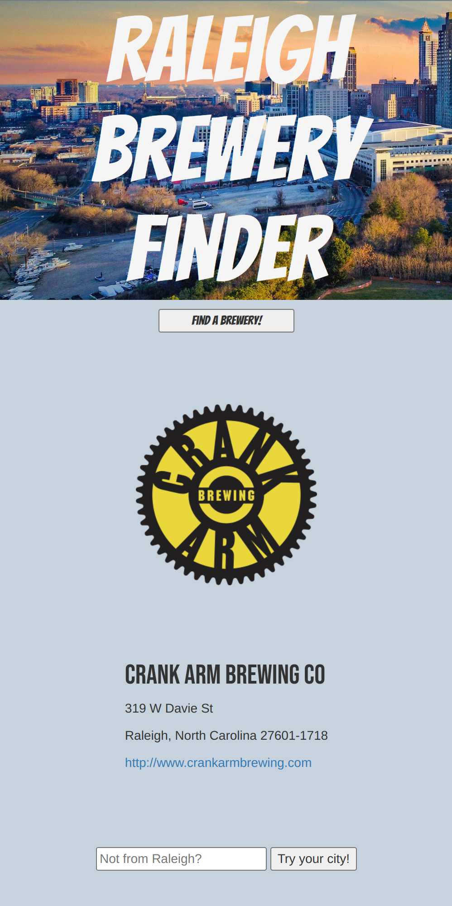

# Raleigh Brewery Finder

#### An app designed to help users find a brewery in Raleigh by clicking a button that provides basic information of a randomized brewery

## Description

The Raleigh Brewery Finder is an app designed to help users find a randomized brewery in Raleigh, NC and provided basic information (name, address, phone number, website, and logo).

## Technologies Used

- HTML5
- CSS3
- JavaScript
- jQuery
- AJAX
- Google Fonts
- Photoshop
- Open Brewery DB API

## Features

- Users can click a button to generate basic information of a randomized brewery in Raleigh, NC
- App pulls brewery infomration from 3rd party API

## Wireframe

- https://davepackard746984.invisionapp.com/freehand/Raleigh-Brewery-Finder-Gev5V0cvS?autoname=

## Trello Planning

- https://trello.com/b/BCmaIDEh/to-do

## Project's Future

- Users will be able to enter their city into the form at the bottom and click the button to load randomized breweries from their city
- Added landing page that will provide basic instruction on how to best utilize the app
- Added modals to make for a more engaging experience

## Deployed Link

- https://raleighbreweryfinder.netlify.app/
